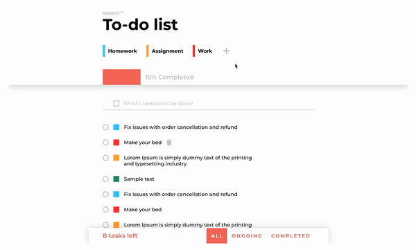

# Stepout Frontend Intern Assignment

You will have 14 days to complete your assignment. Please notify us when you are done with the tasks. Send an email to trung@stepout.fi when you are done or if you have any questions. Happy coding and good luck!

## Installation and Setup

Adobe XD is a free design tool where you must use to get the exact design value on the web application design implementation.

All UI resouces could and should be refered to by using the [itern-test-UI.xd](./intern-test-UI.xd) file.

## Assignment Instruction

* The solution must be implemented with React. 
* You can clone or fork the project. 
* You are compulsory to respect the tranditional code structure from [ReactJs docs](https://reactjs.org/docs/design-principles.html)
* You should respect the given design structure from our [prototype links and adobe file](https://xd.adobe.com/view/3d993320-26b8-48b2-7b3f-07e3489fb9ee-4ba8/). 
* Implementation with redux or typescript is a plus.
* Implementation with responsive design is a plus.

## Task

1. Main functionality of a todo application:

    

    * The application must be able to create, delete a todo and update complete of a todo.

2. Categorization:

    

    * The application must be able to add different catogory with these default color: #38C9FF, #FF3838, #FFAB38, #21966B.
    * Each todo must be categorized with one category.
    * The application should also be able to add a customized hexa color for a new category.

3. Progress: 

    * Create a progress bar to keep track of the overal todos progress on completion.

4. Filter:

    * User could see all todos, ongoing todos and completed todos by selection of the bottom navigation bar.

## Tip

* Stepout team loves clean code and would love to see your consideration on readability and performance.
* We love good test case if possible.
* We love to learn about your development through a README
